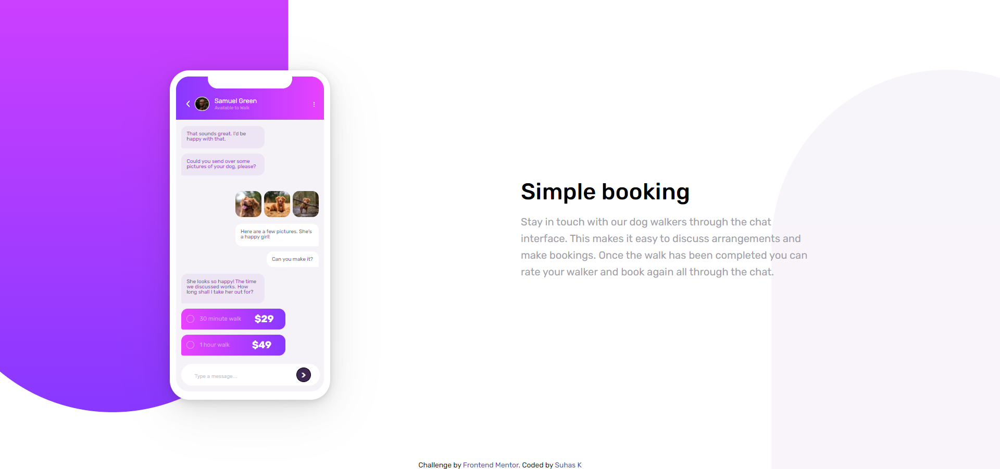

# Frontend Mentor - Chat app CSS illustration solution

This is a solution to the [Chat app CSS illustration challenge on Frontend Mentor](https://www.frontendmentor.io/challenges/chat-app-css-illustration-O5auMkFqY). Frontend Mentor challenges help you improve your coding skills by building realistic projects. 

## Table of contents

- [Overview](#overview)
  - [The challenge](#the-challenge)
  - [Screenshot](#screenshot)
  - [Links](#links)
- [My process](#my-process)
  - [Built with](#built-with)
  - [What I learned](#what-i-learned)
  - [Continued development](#continued-development)
  - [Useful resources](#useful-resources)
- [Author](#author)
- [Acknowledgments](#acknowledgments)


## Overview

### The challenge

Users should be able to:

- View the optimal layout for the component depending on their device's screen size
- **Bonus**: See the chat interface animate on the initial load

### Screenshot




### Links

- Solution URL: [https://github.com/suhaasya/chat-app-with-html-css](https://github.com/suhaasya/chat-app-with-html-css)
- Live Site URL: [https://suhaasya.github.io/chat-app-with-html-css/](https://suhaasya.github.io/chat-app-with-html-css/)

## My process

### Built with

- Semantic HTML5 markup
- CSS custom properties
- Flexbox
- CSS Grid


### What I learned

Use this section to recap over some of your major learnings while working through this project. Writing these out and providing code samples of areas you want to highlight is a great way to reinforce your own knowledge.

To see how you can add code snippets, see below:

```html
<div id="phone-body">
                    <div id="phone-inner">
                        <div id="background">
                        <div id="notch"></div>
                        <div id="header-details-main">
                            <div class="header-details"><form action="">
                                <input id="back-button" type="submit" value="<" >
                               </form></div>
                            <div class="header-details" id="profile-pic"></div>
                            <div class="header-details" id="name-status"><h1>Samuel Green</h1><br>
                                Available to Walk</div>
                            <div class="header-details" id="more-button-div"><form action="">
                                <input id="more-button" type="submit" value="..." >
                               </form></div>
                        </div>
                        </div>
                        <div class="chatbox" id="chat1">That sounds great. I’d be happy with that.</div>
                        <div class="chatbox" id="chat2">Could you send over some pictures of your dog, please?</div>
                        <div id="dogimg">
                            
                            
                            
                        </div>
                        <div class="chatbox" id="chat3">Here are a few pictures. She’s a happy girl!</div>
                        <div id="chat4">Can you make it?</div>
                        <div class="chatbox" id="chat5">She looks so happy! The time we discussed works. How long shall I take her out for?</div>
                        <div class="price-section" id="price-section-1"> <div class="circle" > </div> 30 minute walk <div class="price">$29</div> </div>
                        <div class="price-section" id="price-section-2"> <div class="circle" > </div> 1 hour walk <div class="price" id="price2">$49</div></div>
                        <div id="main-input-box">
                            <div id="input-box">
                              <form action=""><input id="input-text" type="text" placeholder="Type a message…">
                               </form>
                            </div>
                            <div id="submit-botton-box">
                              <form action="">
                                <input id="submit-button" type="submit" value=">" >
                               </form>
                            </div>
                        </div>
                    </div>
</div>
```
```css

.background-img-left {
    position: absolute;
    z-index: -1;
    top: 0;
    left: 0;
    width: 100%;
    height: 70%;
    border-radius: 0 0 270px 270px;
    background: linear-gradient(to bottom, hsl(293, 100%, 63%), hsl(264, 100%, 61%));
    transform: translate(-50%, -30%);
    max-width: 400px;
}

#phone-body{
    position: relative;
    background-color: white;
   
    width: 247px;
    height: 507px;
    padding: 10px;
    border-radius: 30px;
    overflow: hidden;
    box-shadow: 0 0.4px 1.6px rgba(0, 0, 0, 0.017), 0 0.9px 3.6px rgba(0, 0, 0, 0.024),
        0 1.6px 6.3px rgba(0, 0, 0, 0.03), 0 2.5px 10px rgba(0, 0, 0, 0.035),
        0 3.9px 15.5px rgba(0, 0, 0, 0.04), 0 6px 24.1px rgba(0, 0, 0, 0.046),
        0 10px 40px rgba(0, 0, 0, 0.053), 0 20px 80px rgba(0, 0, 0, 0.07);
    box-sizing: border-box;
}
```
```
}
```


### Continued development

I Would Like to work on media queries and animations. its kind of weaker section of me. so will try to do more projects with them.


### Useful resources

- [resource 1](https://www.w3schools.com/) - Its best website for documentations.
- [resource 2](https://github.com/mcornale/chat-app-css-illustration) - I Had Seen his answer to see how to add background


## Author

- Github - [@Suhaasya](https://github.com/suhaasya?tab=repositories)
- Frontend Mentor - [@suhaasya](https://www.frontendmentor.io/profile/suhaasya)
- Twitter - [@tech_suhas](https://www.twitter.com/tech_suhas)

## Acknowledgments

I would like to thank Massimiliano Cornale, i seen his code for making that background still my version not look like mockup but his does.

